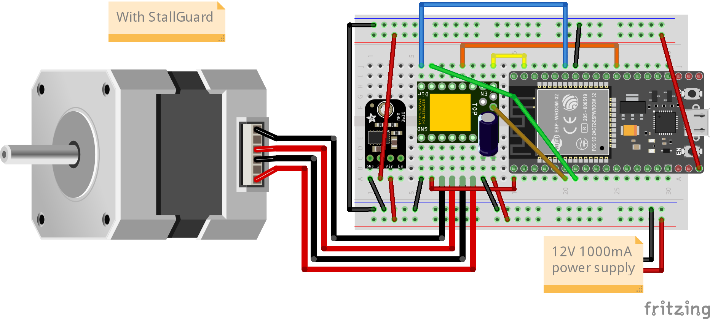
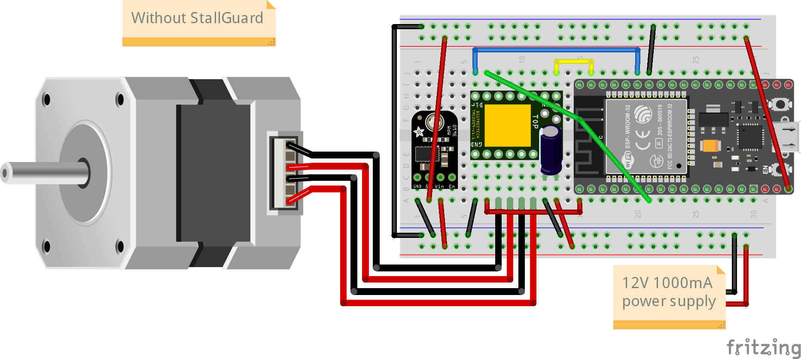
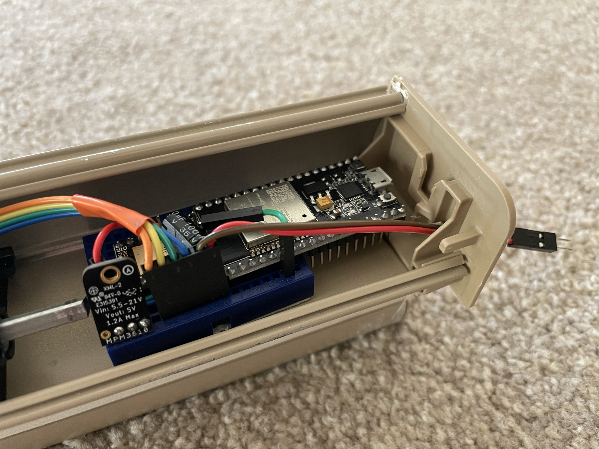

# ESP32 Motorcover
A ESP32-based DIY motorcover solution for smarthomes. A [**cover**](https://www.home-assistant.io/integrations/cover/)
is a rollershutter, blind, shade, window, etc. in [**Home Assistant**](https://www.home-assistant.io/). A motorized
cover provides the ability to control your covers via your choice of smarthome hub/system (HA, Alexa, etc.). Currently,
the ESP32 motorcover interfaces via WiFi/MQTT. HTTP GET requests and ESP-now are coming in the near future.

https://user-images.githubusercontent.com/52260129/211658800-c67d9bb7-6f65-4ab0-a19c-eaa4f9b99e2e.mp4

## Motivation
Commercial available motorized honeycomb cellular shades start from $250-$400 per unit but the quality in terms of
the speed, noise level, build material, and user expreience are below my expectations. On the other hand, premium
honeycomb cellular shades are too expensive so I've decided DIY my existing cordless honeycomb shades. There're DIY
projects for motorized roller shade/blind and tilting control for venetian blind but not for honeycomb shade. I
believe the reason is that honeycomb shade is a heavier cover, therefore, more challenging to lift. This project
focuses on using powerful (geared) NEMA motor and silent stepper driver TMC2209 to move heavier covers swiftly and
silently within a reasonable budget.

## Parts List
These are the exact parts I used to make 5 motorized shades. It was **~$92/unit** but if you own a 3D printer, some
wires and screws, the cost can be lowered to **~$80/unit**. Since the motor requires to fit inside the top compartment
of the shades, NEMA 11 stepper motors with the 5.18:1 planetary gears is the optimal choice to be small and still have
enough torque. If you don't need to conceal the motor, you can get bigger and cheaper motors on Amazon for ~$15/unit +
free shipping. Note the UART version of the TMC2209 stepper driver comes with UART enabled already so you don't need to
manually solder the pads underneath.

|Item                         |Cost (incl. tax)|Quantity|Shipping|Subtotal   |Links|
|-----------------------------|---------------:|:------:|-------:|----------:|:---:|
|NEMA bipolar stepper motor   |          $33.34|       5|  $33.12|    $199.82|[[Stepperonline]](https://www.omc-stepperonline.com/nema-11-stepper-motor-bipolar-l-45mm-w-gear-ratio-5-1-planetary-gearbox-11hs18-0674s-pg5)|
|ESP32 node mcu               |          $12.10|       5|        |     $60.50|[[Amazon]](https://www.amazon.com/dp/B0718T232Z)|
|Buck convertor               |           $5.95|       5|   $7.99|     $37.74|[[Mouser]](https://www.mouser.com/ProductDetail/485-4739)|
|TMC2209 UART stepper driver  |          $34.12|       1|        |     $34.12|[[Amazon]](https://www.amazon.com/gp/product/B07YW7BM68)|
|Coupling                     |          $14.96|       1|        |     $14.96|[[Amazon]](https://www.amazon.com/gp/product/B07MPFJGZW)|
|100uF capacitor              |           $6.82|       1|        |      $6.82|[[Amazon]](https://www.amazon.com/gp/product/B07Y3F194W)|
|Solderless breadboard        |           $6.59|       1|        |      $6.59|[[Amazon]](https://www.amazon.com/gp/product/B07LF71ZTS)|
|Power supply                 |          $17.51|       2|        |     $35.02|[[Amazon]](https://www.amazon.com/gp/product/B07N18XN84)|
|Wires                        |          $14.86|       1|        |     $14.86|[[Amazon]](https://www.amazon.com/gp/product/B07Z4W6V6R)|
|Mounting bracket (Shapeways) |           $6.04|       5|   $9.99|     $40.20|[[STL File]](resources/mounting_bracket_v3.stl)[[Mirrored]](resources/mounting_bracket_v3_mirrored.stl)|
|Screws                       |          $10.00|       1|        |        $10|     |
|Total                        |                |        |        |**$460.63**|     |

## Usage
### 1. Hardware Connections
You can use this without StallGuard 4. SG is a TMC2209 feature that enables the stepper motor to stop in an instance
when encountering a resistance. SG is convenient for setting the minimum position for the shades, i.e. sensorless
homing. It is also useful for protecting pets/children in the case of motorized windows. You don't need to connect
**DIAG_PIN** and **TXD2** if you don't planning on using SG.

### 2. Flashing Firmware
#### Dependencies
You will need to add [TMCStepper](https://github.com/teemuatlut/TMCStepper), [PubSubClient](https://github.com/knolleary/pubsubclient),	[FastAccelStepper](https://github.com/gin66/FastAccelStepper) to your library. I'm using VSCode + PlatformIO so I need to add the libraries to my project as well.

#### Adding WiFi/MQTT Credentials and Setting Motor Specs
Clone this repo and follow the instructions in [motor_settings.h](include/motor_settings.h) and [secrets_example.h](include/secret_example.h). Flash the firmware to the ESP32 via your choice of IDE. It is handy to have the motor specifications for this part.

### 3. Sending Commands via MQTT
You will need a MQTT server/broker. You can run one on rpi4 or a docker.
* inTopic is where the motorcover will receive MQTT commands. For example, I set "/server/shades/1" on the MQTT server to send commands to the motorshade.
* outTopic is where motorcover will send MQTT messages to update its state. For example, I set "/client/shades/1" on the MQTT server to receive messages from the motorshade.
* Home Assistant provides an integration for [MQTT covers](https://www.home-assistant.io/integrations/cover.mqtt/)
* **MQTT Commands:**
    * **0~100: move to position(%);** 0 -> open, 100 -> close
    *  **-1  : stop**
    *  **-2  : open**
    *  **-3  : close**
    *  **-4  : set min position**
    *  **-5  : set max position**
    *  **-99 : reboot system**

### 4. Tuning StallGuard 4 (Optional)
If you decided to use SG, you will need some patience to tune it to be useable. Here are the steps:
* Set the minimum RMS current required to move your cover.
* Set acceleration together with voltage. The acceleration needs to be low enough to not trip SG when the motor starts
moving. Sometimes the voltage is not high enough to accelerate the motor to max speed and trips SG. I had to use 12V
to make sure the motor accelerates up to max speed.
* Adjust the sensitivity of SG by changing sgThreshold.

## Sample Use Case - Honeycomb Cellular Shades
### Spring Dampening
With cordless honeycomb cellular shades, there are a couple of different designs for the cordless mechanism. Mine is an
older simpler design, which just contains an axle driving 2-3 spools to lift the shade via an internal cord. It has a
tape-like spring connected to the axle to prevents the shade from dropping when it is retracted. I would advise to keep
it to prevent the shade from falling by itself when the motor's holding current is cut.

With the spring, I've discovered that the shade will "overshoot" when opening if the shade is too light because the
spring is pulling in the same direction as the motor and causing a bouncing effect when the motor is stopped. One way
to fix this issue is by adding weights at the bottom of the shade so it dampens the bouncing effect. My shades all come
with 2 metal rods and weights each at the bottom. I took out the weights so the motor requires less torque to lift the
shades. If your motor is powerful enough to lift the cover without reducing the weight, leave it as-is; if your cover
overshoots when retracting, add some weights.

### Sound/Vibration Dampening
I have an old mousepad laying around so I cut it into small pieces and placed it underneath the stepper motor mounting
bracket to reduce the vibration and provide a bit of sound dampening. Most of noise comes from the spring retracting
and the bearings of the stepper motor, which is unavoidable. Also, the slower the speed is, the quieter the motorshade
is.

### Installation
Here are some photos of the assembled controller using all off-the-shelf components. The 3D file for the mounting bracket can be found under the resource folder.

## Resources
### TMC2209 Info
* [Trinamic TMC2209 datasheet](https://www.trinamic.com/fileadmin/assets/Products/ICs_Documents/TMC2209_Datasheet_V103.pdf)
* [BigTreeTech TMC2209 V1.2 schematic](https://github.com/bigtreetech/BIGTREETECH-TMC2209-V1.2/blob/master/Schematic/TMC2209-V1.2.pdf)
* [BigTreeTech TMC2209 V1.2 manual](https://github.com/bigtreetech/BIGTREETECH-TMC2209-V1.2/blob/master/manual/TMC2209-V1.2-manual.pdf)
### StallGuard Info
* [How to connect TMC2209 for UART (StallGuard)](https://forum.arduino.cc/t/using-a-tmc2209-silent-stepper-motor-driver-with-an-arduino/666992/14)
* [How to connect TMC2209 for UART (StallGuard) 2](https://forum.arduino.cc/t/tmcstepper-arduino-tmc2209/956036/9)
* [StallGuard example code](https://gist.github.com/metalinspired/dcfe07ed0b9f42870eb54dcf8e29c126)
### ESP-now (future feature)
* [ESP-now scanning devices](https://circuitcellar.com/research-design-hub/design-solutions/using-esp-now-protocol-part-1/)
