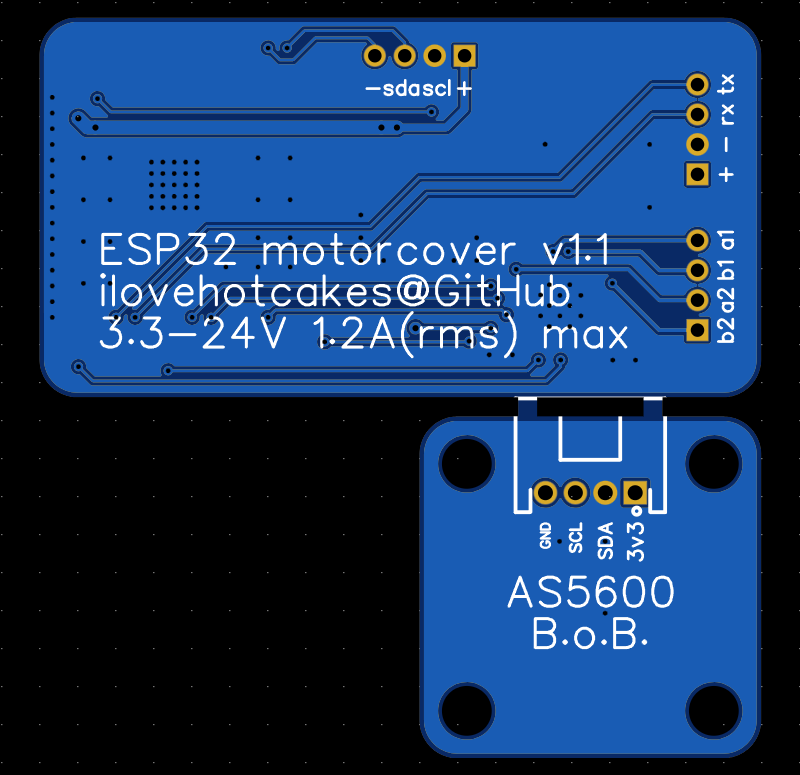

# Electronics
Here are two ways to acquire the electronics: **(1)** directly order printed circuit boards from online PCB services, or **(2)** buying breakout boards and assembling them on a breadboard.

## Option 1 - Ordering PCB from JLCPCB:
1. Download [gerber.zip](gerber.zip) and upload it to [JLCPCB.com](https://jlcpcb.com/). The only setting that needs to be changed is the **"Impedance Control"**. Select **"Yes"** and choose **"JLC0416H-3313"** once the dialog pops up.
2. If you prefer to have the PCB assembled by JLCPCB (additional cost), download the [pick-and-place.csv](pick_and_place.csv) and [bom.csv](bom.csv), and select **"PCB Assembly"**. Click on **"Confirm"** to go the next page.
3. Upload the pick-and-place and bom files. Click **"Process BOM & CPL"** and **"Continue"** when the error pops up. The error is for the missing connectors which will need to be manually solder once the PCBs arrive.
4. Place the order.
5. Once the PCBs arrive, solder connectors **J1-J4** and separate the AS5600 break-off board from the main board.
6. Crimp some 4-pin JST PH connectors and connect the stepper motor to the **"motor"** connector, power supply to the **"pwr"** connector, and AS5600 breakoff board to the **"encoder"** connector.

    
    

## Option 2 - Breadboarding with breakout modules:
Both [TMC2209](https://www.amazon.com/dp/B07ZQ3C1XW) and [AS5600](https://www.amazon.com/dp/B09KGWC1PT/) come in breakout board packages which can be purchased from Amazon/AliExpress and assembled on a solderless breadboard. Please refer to this version of the [bom](prototype/bom.csv) and reference the schematic to put the circuit together.

    

